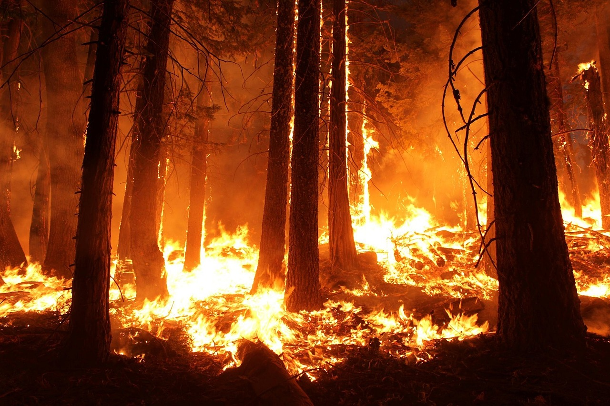

Série spatio-temporelle
================
Guyliann Engels & Philippe Grosjean

## Contexte

Différentes analyses vous sont demandé dont les contexte vous sont
expliqué ci-dessous

### La Schizophrénie

Un test d’activité cérébrale est réalisé sur un patient quotidiennement
durant 120 jours. Au jour 60, les médécins lui prescrivent le
médicament.

Le nouveau médicament a t’il un effet sur l’activité cérébrale du
patient étudié ?

> Jeu de données : schizo.txt

### Les tremblements de terre dans le monde

Les tremblements de terre d’une magnitude supérieur à 7 sont
comptabilisé dans le monde entre 1900 et
1998.

Y a t’il des périodes de fortes activités sismiques ?

> Jeu de données : earthq.txt

### Les feux de forêts au Canada

On dénombre le nombre d’acres de forêt qui est détruit par le
feu.

Est ce que les feux de forêts sont-ils en augmentation ?

> Jeu de données : fire.txt

**Note** : 1 acre correspond à 4046 m2

### La population de lynx

Une étude s’intéresse aux lynx capturés entre 1821 et 1934 au
Canada.

> Jeu de données : lynx du package datasets

### La production de bières

La production mensuelle de bière (mégalitres) est encodée mensuellement
depuis 1956. Décomposez cette série avec la méthode des moyennes
mobiles

> Jeu de données : beer.txt

### Croissance d’arbres

Les scientifiques mesurent l’épaisseur de cernes (en cm) sur des arbres
abattus en 1973. Décomposez cette série avec la méthode des moyennes
mobiles

> Jeu de données : cernes.txt

### Variation de la température

Les chercheurs rencensent la température moyenne mensuelle à Melbourne à
partir de janvier 1981. Y a t’il une augmentation de la température au
cours du temps
?

> Jeu de données : temperature\_melbourne\_1981

### Transect de Nice à Calvi

Les chercheurs souhaitent visualiser graphiquement la distribution des
Copépodes le long du transect (Variable
Copepodits1)

> Jeu de données : Marbio du package (Pastecs)

### Production de lait

La production mensuelle de lait par vache est monitoré à partir de
janvier 1926. Y a t’il une évolution linéaire? Le cycle annuel est
modélisable
?

> Jeu de données : milk\_product\_1962

### Variation de la population en Australie

Les chercheurs rencensent mensuellement le population Australienne à
partir de 1978. Ils souhaitent savoir si la croissance a été
linéaire.

> jeu de données : demographie.txt

## Objectifs

Nous attendons des rapports individuels liés à chaque situation
présentée précédement sous le format d’un R Markdown ( format de
sortie libre). Il ne s’agit pas de rapports scientifiques conventionnels
dont vous connaissez bien la structure (introduction, matériels &
méthodes, but, ….).

Vousq devez considérer ces rapports comme des carnets de laboratoires.
Lors d’une expérience, tout est consigné dans le carnet de laboratoire.

Votre rapport doit respecter la logique suivante :

  - But : Quelle est la question que vous vous posez ? Cette information
    se trouve dans la section ci-dessus.

  - Analyse : Cette section doit montrer l’évolution de votre analyse
    des données. Chaque graphiqe ou chaque modèle doit être commenté
    dans le texte en dessous de ce dernier.

**Note :** Les données sont mises à votre disposition au sein du dépôt
dans le dossier data
